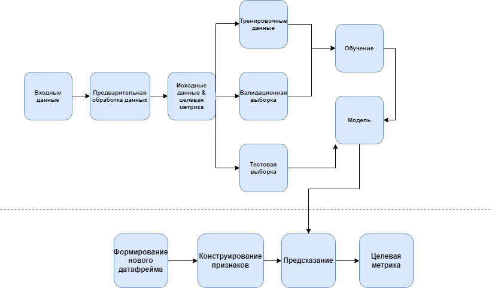
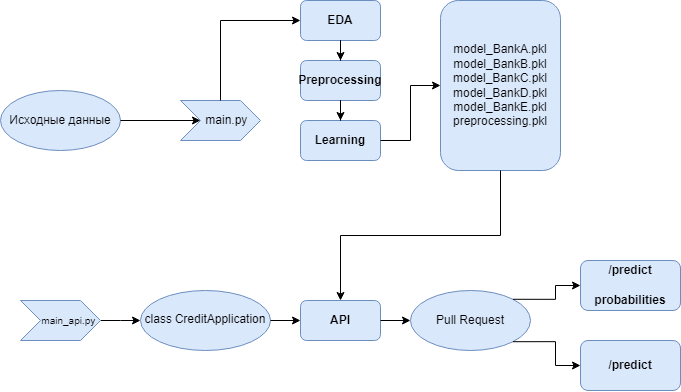
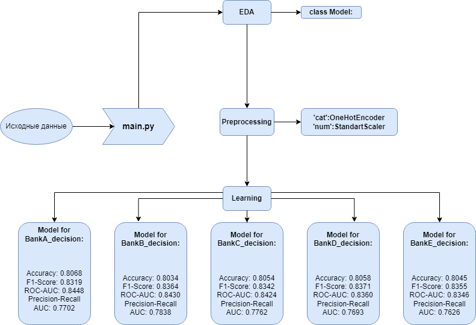
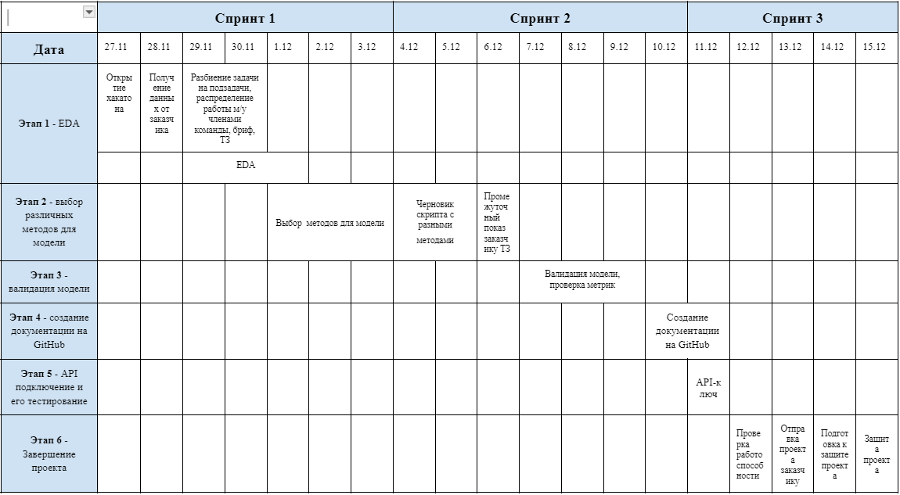
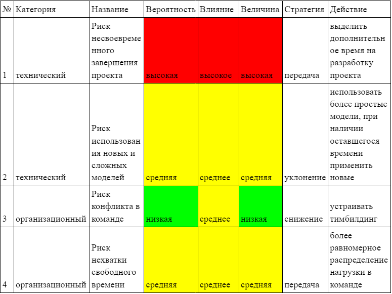

# Документация к задаче Хакатона.
---

## Цель по SMART
- S-specific (Конкретный)
- M-Measurable (Измеримый)
- A-Achievable (Достижимый)
- R-Relevant (Значимый)
- Time-bound (Ограниченный по времени)

<table>
  <tr>
    <th>Критерий</th>
    <th>Вопрос</th>
  </tr>
  <tr>
    <td>S-specific (Конкретный)</td>
    <td>Необходимо создать ML-модель, которая сможет предсказывать заранее вероятность получения кредита клиентом в конкретных 5-ти банках. 
Модель будет обучаться на исторических данных заявок на кредит, содержащих информацию о демографических данных, финансовом положении, загруженности, а также учитывать категорию кредита по уровню риска.
Проект ориентирован на сектор потребительского кредитования, задачей которого является точная и быстрая оценка кредитоспособности клиента.</td>
  </tr>
  <tr>
    <td>M-Measurable (Измеримый)</td>
    <td>На вход модели подается анкета заявителя, на выходе вероятность выдачи кредита по каждому из 5-ти банков.
Подобрать наилучшую модель из ансамбля моделя с лучшей общей точностью. 
Достичь максимальной Accuracy модели путем перебора методов, но не меньше 70% на каждый из банков.</td>
  </tr>
    <td>A-Achievable (Достижимый)</td>
    <td>Мы планируем использовать продвинутые алгоритмы машинного обучения, такие как случайный лес и градиентный бустинг, для разработки нашей модели. Эти алгоритмы были выбраны за их эффективность в решении подобных задач и способность обрабатывать большие объемы данных. Кроме того, мы будем использовать методы оптимизации, включая тюнинг гиперпараметров и кросс-валидацию, чтобы обеспечить наилучшую производительность и точность нашей модели. Эти подходы помогут нам достичь наших целей, делая их вполне достижимыми. Модель будет выложена на GitHub, подключение к приложению заказчика будет возможно через API-ключ.
    В разработке модели участвуют 5 человек.</td>
  </tr>
    <td>R-Relevant (Значимый)</td>
    <td>Интеграция разработанной нами модели в приложение приведет к значительному повышению эффективности процесса принятия решений о выдаче кредитов. Это ускорит обработку заявок и снизит риски, связанные с кредитованием, благодаря более точной и быстрой оценке кредитоспособности клиентов. Таким образом, мы не только улучшим операционную эффективность, но и повысим удовлетворенность клиентов, предлагая им более быстрые и надежные решения по кредитам.</td>
  </tr>
    <td>Time-bound (Ограниченный по времени)</td>
    <td>Мы планируем установить конкретные промежуточные сроки для каждого этапа нашего проекта с учетом пожелания заказчика, что позволит нам систематически контролировать прогресс и обеспечивать своевременное выполнение задач. Эти этапы включают получение данных, предобработку, разработку и тестирование модели. Например, мы планируем завершить предобработку данных к 03.12.2023, а разработку и первичное тестирование модели к11.12.2023. Эти временные рамки помогут нам оставаться сфокусированными и эффективно использовать наши ресурсы.</td>  
</table>

---
## Концепция Модели Кредитного Скоринга - Application-Scoring

Мы разрабатываем передовую модель кредитного скоринга в рамках нашего проекта **Mandarin**, основанную на концепции *application-scoring*. Наша модель направлена на оценку вероятности одобрения кредитных заявок в реальном времени, используя данные анкет заявителей. 

**Основные Направления Работы:**

### Исходные Данные
Мы сосредоточимся на анализе широкого спектра признаков, включая:
- Доход
- Должность
- Возраст
- Семейное положение
- Количество детей
- Цель кредитования

Эти данные помогут нам создать более точный профиль заемщика.

### Обработка Данных
Важным аспектом является выявление и исключение ошибочных или неправдоподобных данных, таких как:
- Несоответствующий возраст
- Нереалистичные доходы

Это повысит достоверность наших оценок.

### Алгоритмы и Методы
Мы используем продвинутые алгоритмы машинного обучения, в том числе:
- **Logistic Regression:** Требует тщательной предобработки пропущенных значений.
- **XGBClassifier:** Эффективно обрабатывает пропуски в данных.

Для улучшения качества модели мы применяем:
- **ENN (Edited Nearest Neighbours):** Уменьшение влияния выбросов.
- **SMOTE (Synthetic Minority Over-sampling Technique):** Решение проблемы дисбаланса классов.

Эти методы в совокупности обеспечивают надежность и точность наших прогнозов.

---
## План реализации проекта

### Этап 1: Исследовательский Анализ Данных (EDA)
- **Анализ данных:** Оценка качества данных, идентификация пропущенных значений, аномалий и выбросов.
- **Визуализация данных:** Создание графиков и диаграмм для понимания распределения данных.
- **Предварительные выводы:** Выявление ключевых факторов, влияющих на моделирование.

### Этап 2: Выбор Методов для Модели
- **Выбор алгоритмов:** Определение моделей машинного обучения.
- **Эксперименты:** Применение техник обработки данных и настройки моделей.

### Этап 3: Валидация Модели
- **Валидация:** Проверка производительности модели на тестовом наборе.
- **Оценка метрик:** Точность, Recall, Precision и другие показатели.
- **Итеративное улучшение:** Доработка модели по результатам.

### Этап 4: Создание Документации на GitHub
- **Техническая документация:** Описание архитектуры и процесса работы модели.
- **Руководство пользователя:** Инструкции по использованию системы.

### Этап 5: API Подключение и Тестирование
- **Разработка API:** Интеграция модели с внешними системами.
- **Тестирование API:** Проверка надежности и совместимости.

### Этап 6: Завершение Проекта
- **Финальная проверка:** Удостоверение корректной работы всех элементов.
- **Деплоймент:** Развертывание модели в рабочей среде.
- **Заключительная презентация:** Демонстрация результатов проекта.

---
## Pipeline модели

### Использование модели в процессе принятия решен

---
### Результаты модели

## Практическая ценность и применимость

### Усовершенствование Процесса Принятия Решений о Кредитовании:
Используя исторические данные об одобрении и отклонении кредитных заявок, наша модель способна с высокой точностью предсказывать исходы новых заявок. Это обеспечивает более быстрый и эффективный процесс принятия решений, снижая операционные затраты и время ожидания для клиентов.

### Повышение Конверсии и Увеличение Выручки:
Наша модель направлена на повышение конверсии покупателей, предлагая им более доступные и удобные условия кредитования. Это, в свою очередь, способствует увеличению продаж и общей выручки для компаний, использующих наше приложение.

### Точность Предсказаний на Основе Данных Анкеты:
Модель разработана для анализа данных, предоставляемых заемщиками в анкетах, что позволяет точно предсказывать вероятность одобрения заявки на основе ограниченного набора информации. Это повышает удобство для пользователей и ускоряет процесс оценки кредитоспособности.

### Гибкость и Адаптируемость:
Модель легко адаптируется под различные бизнес-модели и условия кредитования, что делает ее применимой для широкого спектра компаний, от малого бизнеса до крупных корпораций.

---
## Команда и план действий
- Роли и задачи членов команды.

---
## Road map

---
## Риски

## Риск Несвоевременного Завершения Проекта
- **Планирование и Управление:** Внедрение эффективного управления с четкими сроками.
- **Резервирование Ресурсов:** Предусмотрение дополнительных ресурсов.
- **Коммуникация и Координация:** Постоянная коммуникация для решения проблем.

## Риск Разработки Модели с Недостаточной Точностью
- **Качество Данных:** Тщательная предобработка данных.
- **Многообразие Тестирования:** Кросс-валидация и различные наборы данных.
- **Итеративная Оптимизация:** Постоянное улучшение модели.

## Дополнительные Риски
- **Технологические Риски:** Изучение и тестирование новых технологий.
- **Риски Изменения Требований:** Гибкость в планировании и адаптация к новым условиям.

---
## Матрица оценки рисков

---
## Заключение
В рамках установленных временных рамок наша команда успешно разработала и внедрила передовую ML-модель для прогнозирования вероятности одобрения кредитных заявок клиентами пяти банков-партнеров. Этот проект демонстрирует новаторский подход в сфере кредитного скоринга, где в качестве основы для анализа используются исключительно данные анкет заявителей. Это отличается от традиционных методов, требующих более обширного набора данных о заявителе.

Наша модель, обогащенная современными алгоритмами машинного обучения и методами обработки данных, включая Logistic Regression и XGBClassifier, а также техниками балансировки данных, такими как ENN и SMOTE, позволяет не только точно оценить вероятность одобрения заявки, но и эффективно выявлять ошибочно заполненные или фейковые анкеты. Это обеспечивает существенное улучшение в качестве и надежности процесса кредитования, повышая конверсию и, соответственно, доходы для наших партнеров-банков и приложения.

Ключевым достижением проекта является не только разработка высокоточной модели, но и успешное управление рисками, связанными с разработкой и внедрением такой системы, включая точное соблюдение установленных сроков и обеспечение гибкости в адаптации к изменяющимся требованиям. В результате, наш проект представляет собой значительный шаг вперед в области кредитного скоринга, предлагая решение, которое сочетает в себе технологическую инновацию и практическую ценность для улучшения бизнес-процессов.

